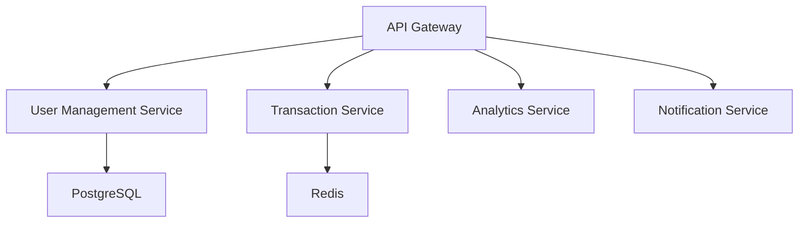
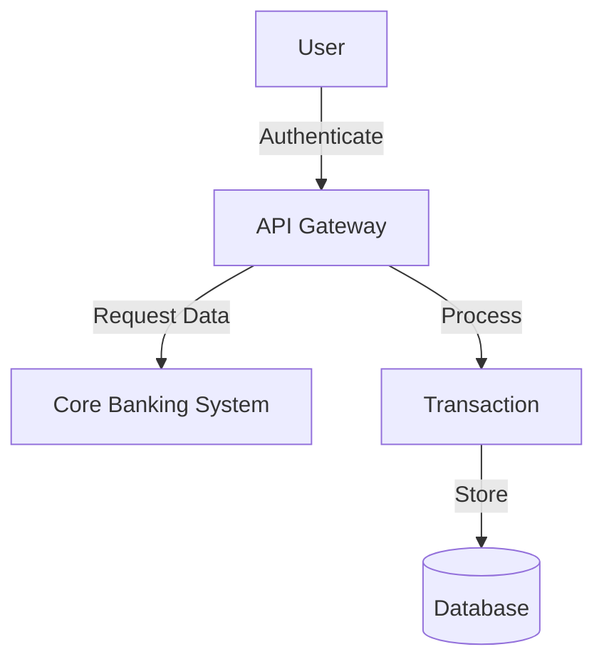

# Technical Specifications - NextGen Mobile Banking Platform

**Generated:** 2025-10-08T19:58:56.700861
**Domain:** Financial Technology
**Priority:** critical
**Word Count:** 721

---

# Technical Specifications Document

## NextGen Mobile Banking Platform

### Introduction

The NextGen Mobile Banking Platform is designed as an advanced mobile application for modern banking customers demanding enhanced security, AI-driven insights, and seamless operation across multiple platforms. This document outlines the technical specifications necessary to meet project objectives and industry compliance while advancing the mobile banking experience.

---

### 1. ARCHITECTURE OVERVIEW

The system's architecture ensures robust performance, scalability, and security through a microservices-based design, hosted on cloud infrastructure. This approach is complemented by a serverless model for AI processing tasks, enhancing efficiency and reducing operational costs.

**Key Components:**
- **Client Interface**: Cross-platform mobile application (iOS and Android) developed in React Native.
- **Backend Services**: Node.js microservices running on AWS containers.
- **Database Management**: PostgreSQL with Redis for in-memory data caching.
- **AI Processing**: TensorFlow-based model deployment.
- **Security**: Multi-factor biometric authentication mechanisms.
- **Integration Layer**: API gateway to facilitate interactions with legacy banking systems.

---

### 2. SYSTEM ARCHITECTURE

**Microservices Architecture:**
- **API Gateway**: Centralized access management.
- **User Management Service**: Handles authentication and user profiles.
- **Transaction Service**: Real-time monitoring and processing.
- **Analytics Service**: AI-powered spending insights.
- **Notification Service**: Engages users with timely alerts.

**Diagram:**

---

### 3. TECHNOLOGY STACK

- **Frontend**: React Native for UI consistency across devices.
- **Backend**: Node.js for scalable server-side applications.
- **Database**: PostgreSQL for relational data, Redis for caching.
- **Cloud**: AWS for hosting, leveraging S3, Lambda, and RDS.
- **AI Framework**: TensorFlow for deep learning models.
- **Containerization**: Kubernetes for managing microservices.

---

### 4. DATABASE DESIGN

**Data Models:**
- **User**: ID, Username, PasswordHash, BiometricData, Preferences.
- **Account**: AccountID, UserID, Balance, AccountType, TransactionHistory.
- **Transaction**: TransactionID, AccountID, Type, Amount, Timestamp, Status.
- **Notification**: NotificationID, UserID, Message, ReadStatus.

**ER Diagram Description:**

The database is structured to prioritize relational consistency and transaction performance with foreign key constraints ensuring referential integrity between tables.

---

### 5. API SPECIFICATIONS

- **Authentication Endpoint**: `/api/v1/auth`
  - Method: POST
  - Inputs: Username, Password/BiometricToken
  - Response: Authentication Token

- **Transaction Status**: `/api/v1/transactions/{id}/status`
  - Method: GET
  - Response: JSON object with transaction details.

---

### 6. SECURITY REQUIREMENTS

- **Multi-factor Authentication**: Integration of biometrics and device-based second factors.
- **End-to-End Encryption**: TLS 1.3 for data transmission, AES-256 for storage.
- **Regular Security Audits**: Quarterly assessments following PCI DSS guidance.

---

### 7. PERFORMANCE REQUIREMENTS

- **Response Time**: Average <200ms for API calls.
- **Uptime**: 99.9% for critical services.
- **Scalability**: Elastic scaling via Kubernetes to manage 5,000 concurrent users.

---

### 8. SCALABILITY CONSIDERATIONS

- **Vertical Scaling**: Utilize AWS resources to scale vertically during peak loads.
- **Horizontal Scaling**: Kubernetes clusters to ensure redundancy and distribution.

---

### 9. INTEGRATION REQUIREMENTS

- **Legacy System Integration**: RESTful APIs with middleware for compatibility and data transformation.
- **Third-party Compliance APIs**: For fraud detection and KYC verification.

---

### 10. ERROR HANDLING

- **Logging**: Centralized log management using ELK Stack.
- **Error Codes**: Standardized API error responses, e.g., 400 for client error, 500 for server error.
- **User-Friendly Messages**: Clear error prompts and recovery advice in-app.

---

### 11. MONITORING AND LOGGING

- **Monitoring Tools**: AWS CloudWatch for system metrics, Prometheus for application-specific monitoring.
- **Alerting**: Threshold-based alerts configured for immediate notification on SLA breaches.

---

### 12. DEPLOYMENT ARCHITECTURE

- **Continuous Integration/Continuous Deployment (CI/CD)**: GitLab pipelines for automated testing and deployment.
- **Container Orchestration**: Kubernetes to manage multi-region deployments.
- **Environment Segmentation**: Different environments for development, staging, and production for risk reduction.

---

### 13. DATA FLOW DIAGRAMS

**Level 0 Data Flow Diagram:**

---

### 14. TECHNICAL CONSTRAINTS

- **Legacy Integration**: Limited modification abilities in older systems.
- **Regulatory Compliance**: Adhering to multiple stringent financial regulations.

---

### 15. DEVELOPMENT STANDARDS

- **Code Quality**: Adherence to ESLint and Prettier for JavaScript code.
- **Documentation**: Continuous updates via Doxygen for API documentation.
- **Version Control**: Git protocols for source control, following Git Flow branching model.

---

This comprehensive technical specification document outlines the high-level design, architecture, and technical foundation needed to build the NextGen Mobile Banking Platform, ensuring alignment with business goals and compliance mandates.